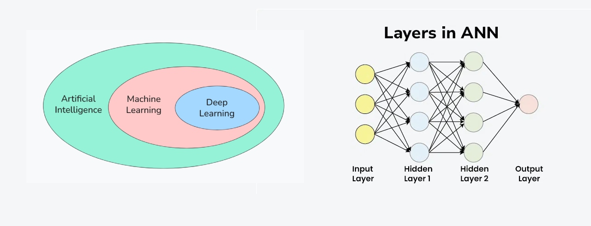

# L001 - What is Deep Learning? Deep Learning Vs Machine Learning

    

### What is Deep Learning?

*   Deep Learning is a **sub-field of Artificial Intelligence (AI)** and **Machine Learning (ML)**.
*   It is **inspired by the structure of the human brain**.
*   Deep Learning algorithms attempt to draw similar conclusions as humans by continuously analyzing data with a **logical structure called a neural network**.
*   **AI** is the broader goal of creating intelligent machines similar to humans.

*   **Machine Learning** is a sub-field of AI where machines learn from data to figure out the relationship between input and output.
*   **Deep Learning** is a sub-field of Machine Learning that uses **neural networks**, which are inspired by the human brain, to find relationships in data, whereas traditional Machine Learning often relies on statistical techniques.

### Neural Networks

*   A **neural network** is a logical structure inspired by the human brain, designed to mimic human thinking processes.
*   The most basic type is an **Artificial Neural Network (ANN)**.
*   Its fundamental units are **perceptrons (circles)**, which are connected by **arrows representing weights**.
*   Neural networks are organized into **layers**:
    *   **Input layer:** Where data is fed into the network.
    *   **Output layer:** Where the results are obtained.
    *   **Hidden layers:** Layers between the input and output. The "deep" in Deep Learning comes from having **multiple hidden layers**.
*   There are different types of neural networks designed for specific tasks:
    *   **Convolutional Neural Networks (CNNs):** Excellent for **image data**.
    *   **Recurrent Neural Networks (RNNs):** Good for **speech, time-series, and textual data**.
    *   **Generative Adversarial Networks (GANs):** Can **generate text and images**.

### Representation Learning (Automatic Feature Extraction)

*   **Representation learning** (also called **feature learning**) is a core concept in Deep Learning.
*   In traditional Machine Learning, **feature engineering/extraction** is often a manual process where domain experts define and extract relevant features from the data (e.g., size, color for image classification).
*   Deep Learning **automates this process**: you provide raw input data, and the algorithm automatically extracts features through its multiple layers.
*   **How it works:** In image processing, lower layers of the neural network identify basic, primitive features like edges, while deeper layers progressively identify more complex features like shapes, and eventually high-level concepts like faces or specific objects.
*   This means that in Deep Learning, there is **no need for manual feature engineering**.

### Why is Deep Learning So Famous? (Success Factors)

Deep Learning's recent surge in popularity is attributed to several key reasons:

1.  **Applicability and Performance:**
    *   Deep Learning algorithms are applicable across a **wide range of domains**, including computer vision, speech recognition, natural language processing, machine translation, bioinformatics, drug design, medical imaging, and climate science.
    *   In many of these fields, Deep Learning has provided **state-of-the-art performance**, often surpassing human expert performance (e.g., AlphaGo beating the Go world champion).

2.  **Datasets:**
    *   Deep Learning is **data-hungry**, requiring millions of data points for reliable performance, unlike traditional Machine Learning which can work with hundreds or thousands of rows.
    *   The **smartphone revolution** and **internet pricing revolution** (especially around 2010-2015) led to an exponential increase in data generation (e.g., photos, videos, text).
    *   Large companies like Microsoft, Google, and Facebook invested heavily in **labeling this raw data** and then **open-sourced these public datasets** (e.g., MS COCO for image detection, YouTube-8M for video, SQuAD for text Q&A, Google AudioSet for audio). This made research much easier and faster.

3.  **Hardware:**
    *   **Moore's Law** states that the number of transistors on a microchip doubles every two years, while the cost halves, leading to continuously improving and cheaper computing power.
    *   Deep Learning models involve **complex matrix multiplications** and require significant processing power.
    *   The realization that these operations could be handled with **parallel processing**, similar to graphics rendering, led to the adoption of **GPUs (Graphical Processing Units)**. NVIDIA's CUDA platform further accelerated this. GPUs can reduce training time by 10-20 times compared to CPUs.
    *   Other specialized hardware like **FPGAs (Field-Programmable Gate Arrays)** offer speed, low power, reprogrammability, and custom solutions (used by Microsoft Bing).
    *   **ASICs (Application-Specific Integrated Circuits)** are custom-made chips, initially expensive to design but cheaper at scale. Examples include:
        *   **TPUs (Tensor Processing Units)** by Google, specifically designed for Deep Learning model training.
        *   **Edge TPUs** for running models on small, edge devices like drones or smartwatches.
        *   **NPUs (Neural Processing Units)** for accelerating Deep Learning operations on mobile devices.
    *   This shift to custom hardware significantly **accelerated Deep Learning research**.

4.  **Frameworks and Libraries:**
    *   Training Deep Learning models from scratch is complex, so **frameworks and libraries** were developed to simplify the process.
    *   **TensorFlow (Google, released 2015):** Initially powerful but difficult to use.
    *   **Keras:** A user-friendly, high-level API built on top of TensorFlow, which significantly increased its popularity. Keras is now integrated into TensorFlow 2.0. (Used more in industry).
    *   **PyTorch (Facebook, started 2016):** Gained popularity among researchers for its flexibility and ease of use.
    *   Tools like **AutoML (Google)**, **Custom Vision AI (Microsoft)**, and **Create ML (Apple)** provide GUI-based solutions to simplify model creation and deployment. These frameworks made Deep Learning more accessible.

5.  **Deep Learning Architectures:**
    *   Neural network architectures involve different ways of connecting nodes and weights.
    *   Experimenting to find the best architecture for a problem is time-consuming and resource-intensive.
    *   The development of **pre-trained, state-of-the-art architectures** by researchers (e.g., ResNet for image classification, Transformers for NLP, U-Net for image segmentation, Pix2Pix for image translation, YOLO for object detection, WaveNet for speech generation) has been crucial.
    *   This concept, known as **transfer learning**, allows users to download and directly apply these pre-trained models to their own problems, significantly speeding up development and improving performance.

6.  **Community:**
    *   The **passion and dedication of researchers, engineers, and educators** in the Deep Learning field have been instrumental in its growth and advancement, recognizing its potential to change the world.

### Deep Learning vs. Machine Learning: Key Differences

While Deep Learning is a subset of Machine Learning, there are practical differences:

| Feature           | Deep Learning                                         | Machine Learning                                                |
| :---------------- | :---------------------------------------------------- | :-------------------------------------------------------------- |
| **Data Dependency** | **High** (data-hungry; needs millions of data points) | **Low** (can perform well with less data, e.g., hundreds/thousands of rows) |
| **Performance with More Data** | **Scales linearly** with more data, performance improves significantly | Performance **stagnates** after a certain amount of data, even with more input |
| **Hardware**      | Requires **powerful hardware** (GPUs, TPUs, FPGAs) for complex matrix multiplications | Can be trained on **simple machines** using a CPU                |
| **Training Time** | **High** (can take weeks or even months for large datasets) | **Low** (minutes to hours)                                      |
| **Prediction Time** | **Very Fast** once trained                             | Can vary; some algorithms (e.g., KNN) can be slow for prediction |
| **Feature Selection** | **Automatic** (Representation Learning) - algorithm extracts relevant features from raw data | **Manual** (Feature Engineering) - requires domain expertise to create features |
| **Interpretability** | **Low** ("Black Box" phenomenon) - difficult to understand *why* a particular decision was made | **High** (e.g., linear regression coefficients, decision trees) - easy to explain reasoning behind predictions |

*   **Conclusion:** Deep Learning does not entirely replace Machine Learning. Machine Learning is still a better choice for problems with less data, when hardware resources are limited, or when model interpretability is crucial. Deep Learning is like a "sword" for complex problems, while Machine Learning is a "needle" for simpler tasks.